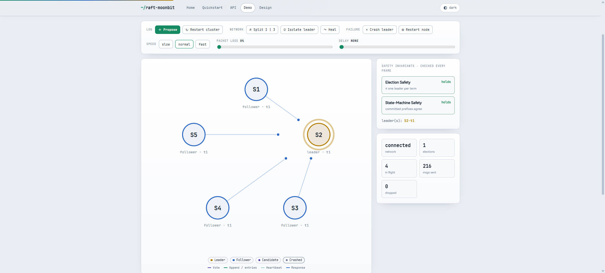

<div align="center">

# raft-moonbit

**A production-grade Raft consensus library in MoonBit — a faithful, line-by-line port of [`etcd-io/raft`](https://github.com/etcd-io/raft).**

[](https://github.com/Lfan-ke/raft-moonbit/actions)
[](#correctness)
[](https://lfan-ke.github.io/raft-moonbit/coverage/)
[](https://mooncakes.io/docs/Lfan-ke/raft-moonbit)
[](LICENSE)

**[▶ Live demo](https://lfan-ke.github.io/raft-moonbit/demo.html)** · **[Docs](https://lfan-ke.github.io/raft-moonbit/)** · **[API](https://lfan-ke.github.io/raft-moonbit/api.html)** · **[Quickstart](https://lfan-ke.github.io/raft-moonbit/quickstart.html)**

<a href="https://lfan-ke.github.io/raft-moonbit/demo.html"></a>

<sub><em>The project home - a faithful MoonBit port of etcd's raft. Click through to the live, in-browser demo.</em></sub>

</div>

Raft keeps a cluster of nodes agreeing on the order of a command log even when nodes crash and the network drops, delays and reorders messages — the foundation of the replicated state machines behind systems such as **etcd, TiKV and Consul**. This library ports the Go [`etcd-io/raft`](https://github.com/etcd-io/raft) (Apache-2.0) to MoonBit, carrying over its protocol core, storage model and **test suite**; see [NOTICE](NOTICE) for what is derived and what is new.

It ships two ways to drive one consensus core:

- a **synchronous driver** (`run_election`, `replicate`) that composes the RPC handlers into whole rounds — small and easy to read or embed; and
- a **message-driven server** (`RaftNode`) that speaks only in `Message`s through `tick` and `step`, so a real transport — or the bundled deterministic simulator — can drive it exactly the way etcd separates protocol logic from I/O.

## Install

```
moon add Lfan-ke/raft-moonbit
```

## Quick example

```moonbit
// Drive a five-node cluster through the deterministic simulator.
let cluster = @raft.Cluster::new(["a", "b", "c", "d", "e"], seed=1)
let leader = cluster.run_until_leader(200)          // elect a leader
let _ = cluster.propose(b"set x = 1")               // replicate a command
let _ = cluster.run_until_committed(2, 200)         // wait for commit

cluster.crash(leader.unwrap())                       // inject a fault
let _ = cluster.run_until_leader(400)               // a new leader takes over
assert_true(cluster.one_leader_per_term())          // safety still holds
assert_true(cluster.committed_agrees())
```

Or run the bundled example — a five-node cluster elects, replicates, loses its leader and re-elects, printing the safety invariants at each step:

```
git clone https://github.com/Lfan-ke/raft-moonbit && cd raft-moonbit
moon run cmd/example
```

<details><summary>Deterministic output (same seed → same transcript)</summary>

```
cluster of 5 nodes, seed 1
elected leader: b
committed 'set x = 1' on a majority
crashed the leader
new leader: c
one leader per term : true
committed prefixes agree : true
safety invariants hold : true
```

Source: [`cmd/example/main.mbt`](cmd/example/main.mbt). The lower-level `Node` / `RaftNode` APIs are used directly in the tests — see `raftnode_wbtest.mbt` (message-driven) and `cluster_wbtest.mbt` (synchronous).

</details>

## Correctness

This is a line-by-line port, and it is verified as one. The porting census ([`PORTING.md`](PORTING.md)) tracks every upstream `Test*` function and has **no `PARTIAL` or `TODO` rows left** — every test that does not depend on Go's runtime is ported assertion-for-assertion, with no simplified cases, no skipped table rows and no weakened assertions; each remaining `N/A` (a goroutine/channel shell, a benchmark, or a Go struct-memory-layout assert) states its MoonBit equivalent.

Three independent methods cross-check behaviour against `etcd-io/raft@26647d5`:

| Method | What it does |
| --- | --- |
| **Transliteration** | The 258 upstream tests ported over. **723 tests** pass on the **wasm / wasm-gc / js** backends, with **[100% line _and_ branch coverage](https://lfan-ke.github.io/raft-moonbit/coverage/)** (3094/3094 points) and zero warnings under `moon check --deny-warn` — CI fails the build if either coverage number regresses. |
| **Adversarial audit** | An audit whose sole instruction is to *falsify* — to find implemented-but-unwired code: a field nobody fills, a parameter forever default, a method with no caller, an ADT variant never constructed. |
| **Differential trace** ([`difftest`](https://github.com/Lfan-ke/raft-moonbit/tree/difftest)) | The same scenarios drive etcd's `RawNode` and this port, compared event-by-event with upstream pinned as a git submodule. Directory restructuring and idiomatic cleanup are held to **zero trace drift**. |

Together they surfaced **24 correctness defects** in the consensus, log and storage layers — safety, liveness, behavioural and accounting — plus 2 default-configuration mismatches, each fixed under a red-then-green regression test that is still in the suite. Several defect classes were then made *unrepresentable*: narrowing a storage error to a single-variant type turned a whole class of mistaken `catch` into a compile error, and exhaustive matching flags any never-constructed variant at build time.

## Live demo — real consensus in your browser

### ▶ https://lfan-ke.github.io/raft-moonbit/demo.html

Five nodes, five Web Workers. Each worker instantiates its own copy of this consensus core compiled to **WebAssembly**, ticks on its own wall-clock timer, and talks to peers only by `postMessage`. The main thread is the network — drop packets, add delay, **split** the cluster, **isolate** or **crash** the leader — and it holds no Raft state of its own. Elections race, messages reorder, nothing about the schedule is deterministic; a panel re-checks the safety invariants (*one leader per term*, *committed prefixes agree*) on every frame.

<a href="https://lfan-ke.github.io/raft-moonbit/demo.html"></a>

Click **Split 2 | 3** and you can watch two nodes lead *different* terms at once - and **Election Safety still holds**, because two leaders only contradict Raft if they share a term, and the stale one cannot reach a majority, so it cannot commit. Heal the partition and it steps down.

It is not a JavaScript re-implementation — messages cross the boundary as flat integers, node state is a JSON string read straight out of the wasm module's linear memory, and every transition happens inside the same MoonBit code the tests exercise (`worker_driver.mbt`). Honest scope: five workers on one machine model *concurrency*, not a distributed deployment, and a restarted node catches up from the leader since the workers have no persistent storage.

<details><summary>Build and run the site locally</summary>

```
moon build --target wasm --release              # -> _build/wasm/release/build/demo/demo.wasm
cp _build/wasm/release/build/demo/demo.wasm docs/raft-moonbit.wasm
python3 -m http.server 8099 --directory docs    # then open http://localhost:8099/
```

Workers `fetch` the wasm, so a `file://` URL will not work.

</details>

## Features

<details open><summary><b>A complete Raft, not a sketch</b> — click to collapse</summary>

- **Leader election** with the Follower / Candidate / Leader roles and the up-to-date-log voting restriction (§5.2, §5.4.1).
- **Pre-vote** so a partitioned node cannot inflate the cluster term, plus randomized election timeouts and heartbeats off a per-node deterministic PRNG.
- **Log replication** through AppendEntries: log-matching, conflicting-suffix truncation, and majority commit within the current term (§5.3, §5.4.2). Replies carry a `conflict_index` hint for one-jump backoff and a `reject_index` that keeps a reordered rejection from driving a spurious back-off; per-follower `Progress` (probe / replicate / snapshot) drives repair, including from heartbeat acks.
- **Snapshots and log compaction** (§7): `compact`, the `InstallSnapshot` RPC, and automatic snapshot fallback for a follower whose next entry was already compacted away.
- **Membership changes** (§4, §6): single-server add/remove and full **joint consensus** with `ConfChangeV2` and auto-leave — C(old,new) needs a majority of *both* halves, and the leader appends the leave entry itself once it commits. A committed change reconfigures the running node: quorums resize, a leader that removed itself steps down, and an in-flight transfer to a removed target aborts.
- **Learners** (§4.2.1): non-voting members that receive the log, never campaign and never count toward a quorum, with promotion to voter and `learners_next`-staged demotion across a joint change.
- **Flow control**: a sliding-window `Inflights` limit, a byte cap per batch (`MaxSizePerMsg`), and a bound on the uncommitted tail (`MaxUncommittedEntriesSize`).
- **`raftLog` split into stable storage and an `unstable` tail** with in-progress bookkeeping and byte-level pagination, so a caller knows exactly what to persist and what to apply.
- **`RawNode` with `Ready` / `Advance`**: ask whether there is work, take a batch (entries to persist, `HardState`/`SoftState` if changed, messages, committed entries, read states), do it, acknowledge — no threads, no async, exactly as etcd's contract describes.
- **Persistence and crash recovery** (§5.3): a `HardState`, an append-only write-ahead log (`WalStore`) with replay, and an etcd-style `MemoryStorage` engine. Storage reads report `Compacted`, `Unavailable` and `SnapOutOfDate` as distinct errors, so a caller can tell "send a snapshot" from "wait".
- **Linearizable reads** in both modes — `ReadOnlySafe` (fresh quorum round-trip) and lease-based — plus **check-quorum**, which steps a leader down when it loses a majority and makes followers refuse disruptive votes.
- **Leadership transfer** (`TimeoutNow`, §3.10): the target is caught up first, proposals are blocked mid-transfer, and it aborts on timeout, step-down or removal.
- **Pluggable `StateMachine`, `Transport`, `LogStore` and `RaftStorage`** traits, with a replicated key-value store as the worked example.
- **Deterministic simulation harness** (`Cluster`): a single-seed discrete-time network that drops, delays, reorders, partitions and crashes/restarts nodes, with built-in safety-invariant checks and a suite of scenario and chaos tests.

</details>

## Architecture

The code follows the upstream `etcd-io/raft` package layout so a reader can audit the port package-by-package. The root `raft.mbt` is a pure facade that re-exports the public surface, so consumers write `@raft.X` regardless of where a symbol lives.

| Package | Responsibility |
| --- | --- |
| `quorum/` | Majority and joint-configuration vote counting |
| `tracker/` | Per-follower `Progress` (Probe / Replicate / Snapshot) and the `Inflights` window |
| `raftpb/` | On-the-wire types: `Entry`, `Message`, RPCs, `HardState`, `Snapshot`, `ConfState`, entry sizing |
| `confchange/` | Configurations, joint consensus, `ConfChange` and the config `Changer` |
| `storage/` | `MemoryStorage`, the write-ahead log, and the `LogStore` / `RaftStorage` traits |
| `log/` | `RaftLog`, the unstable tail, term lookup and bounded slices |
| `core/` | The consensus engine: `RaftNode` / `Node` step & dispatch, election, replication, snapshots, ReadIndex, leader lease, check-quorum, `RawNode` / `Ready`, `Config`, and the simulator |
| `demo/` | The browser bridge: a flat wasm API over `Cluster`, one Web Worker per node |

## License

Apache-2.0. See [LICENSE](LICENSE) and [NOTICE](NOTICE). A MoonBit port of [etcd-io/raft](https://github.com/etcd-io/raft) (Copyright 2015 The etcd Authors); the protocol core, storage model and test suite are derived from it. What this port adds is the MoonBit data model — algebraic data types and exhaustive matching in place of Go structs and switches — a deterministic simulation harness with built-in safety-invariant checks, and a WebAssembly browser demo that runs each node in its own Web Worker.

> Mirrored on [GitLink](https://gitlink.org.cn/heke1228/raft-moonbit) (`heke1228/raft-moonbit`) — same author, same history. The differential-testing harness lives on the [`difftest`](https://github.com/Lfan-ke/raft-moonbit/tree/difftest) branch.
