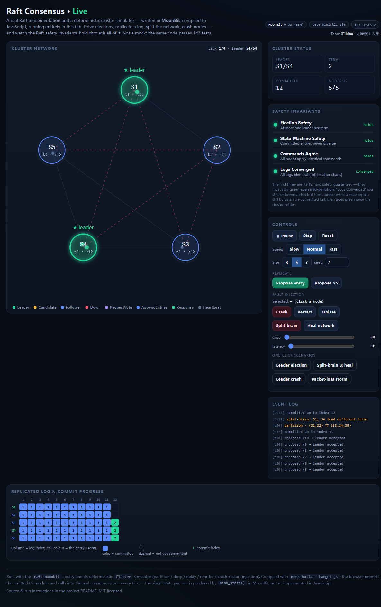

# raft-moonbit

Raft consensus algorithm implemented in MoonBit.

Raft keeps a cluster of nodes agreeing on the order of a command log even when some nodes crash or the network drops, delays and reorders messages. It is the foundation of the replicated state machines used by systems such as etcd, TiKV and Consul. This library is a MoonBit port of the Go [etcd-io/raft](https://github.com/etcd-io/raft) (Apache-2.0), carrying over its protocol core, storage model and test suite; see [NOTICE](NOTICE) for what is derived and what is new.

It ships two ways to run the protocol on top of one consensus core:

- a **synchronous driver** (`run_election`, `replicate`) that composes the RPC handlers into whole rounds — small and easy to read or embed; and
- a **message-driven server** (`RaftNode`) that talks only in `Message`s through `tick` and `step`, so a real transport — or the bundled deterministic simulator — can drive it exactly the way etcd separates protocol logic from I/O.

## Live demo — Raft, running in your browser

**▶ https://lfan-ke.github.io/raft-moonbit/**

The consensus core and the deterministic `Cluster` simulator are compiled to JavaScript with `moon build --target js` and run entirely in the page — no server, no mock. Drive leader elections, replicate a log, split the network into a brain-split, crash and restart nodes, add packet loss — and watch Raft's safety invariants (**Election Safety**, **State-Machine Safety**, command agreement) hold through all of it while the logs reconcile on heal.



The visualization is not a JavaScript re-implementation: it calls straight into the MoonBit code every tick, and everything on screen comes from `demo_state()`, the JSON snapshot the simulator returns. The browser bridge is `demo_driver.mbt`; the front end lives under [`docs/`](docs/).

### Build and run the demo locally

```
moon build --target js --release                 # -> _build/js/release/build/raft-moonbit.js
cp _build/js/release/build/raft-moonbit.js docs/raft-moonbit.js
python3 -m http.server 8099 --directory docs     # then open http://localhost:8099/
```

An ES-module import needs `http(s)`; opening `index.html` as a `file://` URL will not work.

## Features

- **Leader election** with the Follower / Candidate / Leader roles and the up-to-date-log voting restriction (§5.2, §5.4.1).
- **Pre-vote** so a partitioned node cannot inflate the cluster term, plus randomized election timeouts and heartbeats off a per-node deterministic PRNG.
- **Log replication** through AppendEntries: the log-matching check, conflicting-suffix truncation, and majority commit within the current term (§5.3, §5.4.2). Replies carry a `conflict_index` hint for one-jump backoff, and per-follower `Progress` (probe / replicate / snapshot) drives repair — including from heartbeat acks.
- **Snapshots and log compaction** (§7): `compact`, the `InstallSnapshot` RPC, and automatic snapshot fallback for a follower whose next entry has already been compacted away.
- **Membership changes** (§6): single-server add/remove and full **joint consensus** (a C(old,new) transition needing a majority of both halves), carried as `ConfChange` log entries and folded in by a configuration state machine.
- **Persistence and crash recovery** (§5.3): a `HardState`, an append-only write-ahead log (`WalStore`) with replay, and an etcd-style `MemoryStorage` engine with index/term/slice reads, conflict-truncating append, compaction and snapshotting — plus a storage-backed recovery path.
- **Linearizable reads** via ReadIndex / leader lease, and **check-quorum** so a leader that loses contact with a majority steps down.
- **Leadership transfer** (`TimeoutNow`, §3.10) for an orderly handover to a caught-up follower.
- **Pluggable `StateMachine`, `Transport`, `LogStore` and `RaftStorage`** traits, with a replicated key-value store as the worked example.
- **Deterministic simulation harness** (`Cluster`): a single-seed, discrete-time network that drops, delays, reorders, partitions and crashes/restarts nodes, with built-in safety-invariant checks (one leader per term, an agreeing committed prefix, log matching) and a suite of scenario and chaos tests.

## Install

```
moon add heke1228/raft-moonbit
```

## Example

```moonbit
// Drive a five-node cluster through the deterministic simulator.
let cluster = @raft.Cluster::new(["a", "b", "c", "d", "e"], seed=1)
let leader = cluster.run_until_leader(200)          // elect a leader
let _ = cluster.propose(b"set x = 1")               // replicate a command
let _ = cluster.run_until_committed(2, 200)         // wait for commit

// Inject a fault and watch the cluster keep its safety guarantees.
cluster.crash(leader.unwrap())
let _ = cluster.run_until_leader(400)               // a new leader takes over
assert_true(cluster.one_leader_per_term())
assert_true(cluster.committed_agrees())
```

The lower-level `Node` and `RaftNode` APIs are used directly in the tests; see `raftnode_wbtest.mbt` for the message-driven path and `cluster_wbtest.mbt` for the synchronous one.

## Architecture

| File | Responsibility |
| --- | --- |
| `types.mbt` | Log `Entry`, its kind (`Normal` / `ConfChange`), constructors |
| `state.mbt` | `Node` state and the role transitions |
| `log.mbt` | Log operations: append, indices, term lookup, bounded slices |
| `rpc.mbt` | RequestVote / AppendEntries types with backoff hints |
| `election.mbt` | The RequestVote handler and the up-to-date-log rule |
| `replication.mbt` | The AppendEntries handler: matching, truncation, commit |
| `snapshot.mbt` / `snapshot_rpc.mbt` | Compaction, `Snapshot`, the `InstallSnapshot` RPC |
| `hardstate.mbt` / `wal.mbt` / `storage.mbt` / `storage_engine.mbt` | HardState, the write-ahead log, the `LogStore` and `RaftStorage` engines |
| `storage_bridge.mbt` | Persist and rebuild a node through the storage engine |
| `membership.mbt` / `confchange.mbt` | Configurations, joint consensus, `ConfChange` and the config driver |
| `message.mbt` / `progress.mbt` | The routed `Message` type and per-follower progress |
| `raftnode.mbt` / `raftnode_step.mbt` | The message-driven server: timers, campaigns, `tick` / `step` |
| `readindex.mbt` | ReadIndex, leader lease and check-quorum |
| `status.mbt` | Observable server status |
| `leader.mbt` / `cluster.mbt` | The synchronous election and replication driver |
| `statemachine.mbt` / `transport.mbt` | The `StateMachine` and `Transport` traits |
| `sim.mbt` / `sim_check.mbt` | The deterministic simulator and its safety invariants |
| `demo_driver.mbt` | Browser bridge: a flat JSON/scalar API over `Cluster` for the `docs/` demo |

## Roadmap

- [x] Core types, leader election, log replication and commit advancement
- [x] Safety: up-to-date-log restriction and log matching
- [x] Pluggable state machine, transport and storage traits
- [x] Snapshot, log compaction and the InstallSnapshot RPC
- [x] Membership changes: single-server and joint consensus
- [x] Durable persistence: HardState, write-ahead log and a MemoryStorage engine
- [x] Message-driven server: pre-vote, randomized timers, heartbeats
- [x] ReadIndex / lease reads, check-quorum, leadership transfer
- [x] Deterministic simulation harness: partition, loss, reorder, crash — with a chaos suite
- [x] Interactive browser demo compiled from the same code with `moon build --target js`

## License

Apache-2.0. See [LICENSE](LICENSE) and [NOTICE](NOTICE).

## Acknowledgement

This library is a MoonBit port of [etcd-io/raft](https://github.com/etcd-io/raft), Copyright 2015 The etcd Authors, licensed under Apache-2.0. The protocol core, the storage model and the test suite are derived from it. What this port adds is the MoonBit data model — algebraic data types and exhaustive matching in place of Go structs and switch statements — a deterministic simulation harness with built-in safety-invariant checks, and a WebAssembly browser demo that runs each node in its own Web Worker. [NOTICE](NOTICE) records the split.
