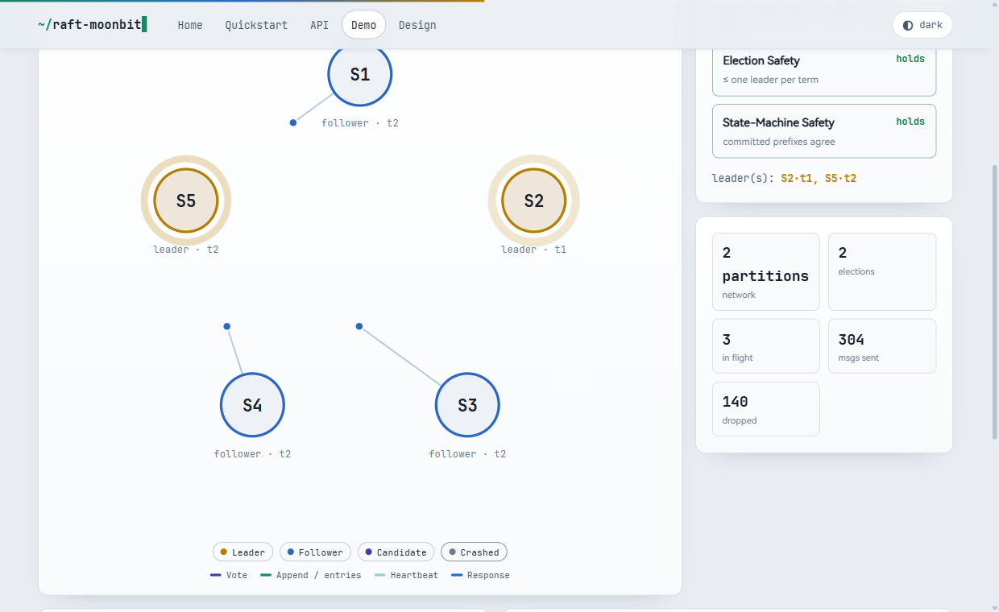

# raft-moonbit

Raft consensus algorithm implemented in MoonBit.

Raft keeps a cluster of nodes agreeing on the order of a command log even when some nodes crash or the network drops, delays and reorders messages. It is the foundation of the replicated state machines used by systems such as etcd, TiKV and Consul. This library is a MoonBit port of the Go [etcd-io/raft](https://github.com/etcd-io/raft) (Apache-2.0), carrying over its protocol core, storage model and test suite; see [NOTICE](NOTICE) for what is derived and what is new.

It ships two ways to run the protocol on top of one consensus core:

- a **synchronous driver** (`run_election`, `replicate`) that composes the RPC handlers into whole rounds — small and easy to read or embed; and
- a **message-driven server** (`RaftNode`) that talks only in `Message`s through `tick` and `step`, so a real transport — or the bundled deterministic simulator — can drive it exactly the way etcd separates protocol logic from I/O.

## Live demo — a Raft cluster running in your browser

**▶ https://lfan-ke.github.io/raft-moonbit/demo.html**

Five nodes, five Web Workers. Each worker instantiates its own copy of this consensus core compiled to WebAssembly, ticks on its own wall-clock timer, and talks to its peers only by `postMessage`. The main thread is the network — it can drop, delay and partition messages, and `terminate()` a worker to crash a node — and holds no Raft state of its own. Elections race, messages reorder, and nothing about the schedule is deterministic.



That screenshot is the point of the whole exercise: under a partition, `S1` leads term 1 and `S3` leads term 2 **at the same time**, and Election Safety still holds. Two leaders are only a contradiction if they share a term; the stale one cannot reach a majority, so it cannot commit. Heal the partition and it steps down.

The demo is not a JavaScript re-implementation. Messages cross the boundary as flat integers, node state comes back as a JSON string read straight out of the wasm module's linear memory, and every state transition happens inside the same MoonBit code the tests exercise. The bridge is `worker_driver.mbt`; the site lives under [`docs/`](docs/).

**Honest about what it is not.** Those five nodes share one machine and one browser, and `postMessage` is not TCP. This is a faithful model of *concurrency*, not of a distributed deployment. A restarted node comes back empty and catches up from the leader, because the workers have no persistent storage.

### Build and run the site locally

```
moon build --target wasm --release              # -> _build/wasm/release/build/raft-moonbit.wasm
cp _build/wasm/release/build/raft-moonbit.wasm docs/raft-moonbit.wasm
python3 -m http.server 8099 --directory docs    # then open http://localhost:8099/
```

Workers `fetch` the wasm, so a `file://` URL will not work.

## Features

- **Leader election** with the Follower / Candidate / Leader roles and the up-to-date-log voting restriction (§5.2, §5.4.1).
- **Pre-vote** so a partitioned node cannot inflate the cluster term, plus randomized election timeouts and heartbeats off a per-node deterministic PRNG.
- **Log replication** through AppendEntries: the log-matching check, conflicting-suffix truncation, and majority commit within the current term (§5.3, §5.4.2). Replies carry a `conflict_index` hint for one-jump backoff and a `reject_index` that keeps a reordered rejection from driving a spurious back-off, and per-follower `Progress` (probe / replicate / snapshot) drives repair — including from heartbeat acks.
- **Snapshots and log compaction** (§7): `compact`, the `InstallSnapshot` RPC, and automatic snapshot fallback for a follower whose next entry has already been compacted away.
- **Membership changes** (§4, §6): single-server add/remove and full **joint consensus** with `ConfChangeV2` and auto-leave — the C(old,new) transition needs a majority of *both* halves, and the leader appends the leave entry itself once it commits. A committed change reconfigures the running node: quorums resize, a leader that removed itself steps down, and an in-flight leadership transfer to a removed target aborts.
- **Learners** (§4.2.1): non-voting members that receive the log, never campaign and never count toward a quorum, with promotion to voter and — through `learners_next` — demotion that is staged across a joint change so the demoted voter keeps voting in the outgoing half until the transition leaves.
- **Flow control**: a sliding-window `Inflights` limit on in-flight AppendEntries, a byte cap on each batch (`MaxSizePerMsg`), and a bound on the uncommitted tail a leader will accept (`MaxUncommittedEntriesSize`).
- **A `raftLog` split into stable storage and an `unstable` tail**, with in-progress bookkeeping, so a caller learns exactly which entries to persist and which to apply, and byte-level pagination on both.
- **`RawNode` with `Ready` / `Advance`**: the caller asks whether there is work, takes a batch (entries to persist, a `HardState` and `SoftState` if they changed, messages to send, committed entries to apply, read states), does it, and acknowledges. No threads, no async — a synchronous state machine, exactly as etcd's contract describes it.
- **Persistence and crash recovery** (§5.3): a `HardState`, an append-only write-ahead log (`WalStore`) with replay, and an etcd-style `MemoryStorage` engine with index/term/slice reads, conflict-truncating append, compaction and snapshotting. Storage reads report `Compacted`, `Unavailable` and `SnapOutOfDate` as distinct errors, so a caller can tell "send a snapshot" from "wait".
- **Linearizable reads** in both of Raft's modes — `ReadOnlySafe`, which confirms leadership with a fresh quorum round-trip, and the lease-based path — plus **check-quorum**, which makes a leader that loses contact with a majority step down and makes its followers refuse disruptive votes.
- **Leadership transfer** (`TimeoutNow`, §3.10): the target is caught up first, proposals are blocked while a transfer is in flight, and the transfer aborts on timeout, step-down or removal of the target.
- **Pluggable `StateMachine`, `Transport`, `LogStore` and `RaftStorage`** traits, with a replicated key-value store as the worked example.
- **Deterministic simulation harness** (`Cluster`): a single-seed, discrete-time network that drops, delays, reorders, partitions and crashes/restarts nodes, with built-in safety-invariant checks (one leader per term, an agreeing committed prefix, log matching) and a suite of scenario and chaos tests.

## Correctness

This is a line-by-line port, and it is verified as one. The porting census ([`PORTING.md`](PORTING.md)) tracks every upstream `Test*` function; after this round it has **no `PARTIAL` or `TODO` rows left**. Every test that does not depend on Go's runtime is ported assertion-for-assertion — no simplified cases, no skipped table rows, no weakened assertions — and each remaining `N/A` (a goroutine/channel shell, a benchmark, or a Go struct-memory-layout assert) states its MoonBit equivalent.

Three independent methods cross-check behaviour against `etcd-io/raft@26647d5`:

- **Transliteration** of the 258 upstream tests: **723 tests** pass on the wasm, wasm-gc and js backends, with **100% line and branch coverage** (3094/3094 coverage points) and zero warnings under `moon check --deny-warn`.
- **An adversarial audit** whose sole instruction is to falsify — to find implemented-but-unwired code: a field nobody fills, a parameter forever left default, a method with no caller, an ADT variant never constructed.
- **A Go-versus-MoonBit differential trace** ([`difftest/`](difftest)): the same scenarios drive etcd's `RawNode` and this port, compared event by event, with upstream pinned as a git submodule. Directory restructuring and idiomatic cleanup are held to zero trace drift.

Together they surfaced **24 correctness defects** in the consensus, log and storage layers — safety, liveness, behavioural and accounting — plus 2 default-configuration mismatches, each fixed under a red-then-green regression test that is still in the suite. Several defect classes were then made unrepresentable: narrowing a storage error to a single-variant type turned a whole class of mistaken `catch` into a compile error, and exhaustive matching flags any never-constructed variant at build time.

## Install

```
moon add Lfan-ke/raft-moonbit
```

The package lives on [mooncakes.io](https://mooncakes.io) under the GitHub account `Lfan-ke`; the GitLink repository `heke1228/raft-moonbit` is the same author and the same history.

## Run the example

A five-node cluster elects a leader, replicates a command, loses that leader and re-elects — printing the safety invariants at each step:

```
git clone https://github.com/Lfan-ke/raft-moonbit && cd raft-moonbit
moon run cmd/example
```

```
cluster of 5 nodes, seed 1
elected leader: b
committed 'set x = 1' on a majority
crashed the leader
new leader: c
one leader per term : true
committed prefixes agree : true
safety invariants hold : true
```

The run is deterministic: the same seed always produces this transcript. Source: [`cmd/example/main.mbt`](cmd/example/main.mbt).

## Example

```moonbit
// Drive a five-node cluster through the deterministic simulator.
let cluster = @raft.Cluster::new(["a", "b", "c", "d", "e"], seed=1)
let leader = cluster.run_until_leader(200)          // elect a leader
let _ = cluster.propose(b"set x = 1")               // replicate a command
let _ = cluster.run_until_committed(2, 200)         // wait for commit

// Inject a fault and watch the cluster keep its safety guarantees.
cluster.crash(leader.unwrap())
let _ = cluster.run_until_leader(400)               // a new leader takes over
assert_true(cluster.one_leader_per_term())
assert_true(cluster.committed_agrees())
```

The lower-level `Node` and `RaftNode` APIs are used directly in the tests; see `raftnode_wbtest.mbt` for the message-driven path and `cluster_wbtest.mbt` for the synchronous one.

## Architecture

The code is organised into packages that follow the upstream `etcd-io/raft`
layout, so a reader can audit the port package by package. The root `raft.mbt`
is a pure facade that re-exports the public surface, so consumers write
`@raft.X` regardless of which package a symbol lives in.

| Package | Responsibility |
| --- | --- |
| `quorum/` | Majority and joint-configuration vote counting |
| `tracker/` | Per-follower `Progress` (Probe / Replicate / Snapshot) and the `Inflights` window |
| `raftpb/` | On-the-wire data types: `Entry`, `Message`, RPCs, `HardState`, `Snapshot`, `ConfState`, entry sizing |
| `confchange/` | Configurations, joint consensus, `ConfChange` and the config `Changer` |
| `storage/` | `MemoryStorage`, the write-ahead log, and the `LogStore` / `RaftStorage` traits |
| `log/` | `RaftLog`, the unstable tail, term lookup and bounded slices |
| `core/` | The consensus engine: `RaftNode` / `Node` step and dispatch, election, replication, snapshots, ReadIndex, leader lease, check-quorum, `RawNode` / `Ready`, `Config`, and the deterministic simulator |
| `node/` symbols | Folded into `core/` (`RawNode` and `RaftNode` are mutually dependent, which MoonBit cannot split across packages) |
| `demo/` | The browser bridge: a flat wasm API over `Cluster` that the `docs/` site drives, one Web Worker per node |

## Roadmap

- [x] Core types, leader election, log replication and commit advancement
- [x] Safety: up-to-date-log restriction and log matching
- [x] Pluggable state machine, transport and storage traits
- [x] Snapshot, log compaction and the InstallSnapshot RPC
- [x] Membership changes: single-server, joint consensus, `ConfChangeV2` auto-leave
- [x] Learners: non-voting members, promotion, and `learners_next` staged demotion
- [x] Durable persistence: HardState, write-ahead log and a MemoryStorage engine
- [x] Typed storage errors: `Compacted`, `Unavailable`, `SnapOutOfDate`
- [x] Message-driven server: pre-vote, randomized timers, heartbeats
- [x] ReadIndex in both modes (`ReadOnlySafe` and lease), check-quorum, leadership transfer
- [x] Flow control: `Inflights` window, `MaxSizePerMsg`, `MaxUncommittedEntriesSize`
- [x] `raftLog` with an `unstable` tail, in-progress bookkeeping and byte pagination
- [x] `RawNode` with the `Ready` / `Advance` contract
- [x] Deterministic simulation harness: partition, loss, reorder, crash — with a chaos suite
- [x] Browser demo: the core compiled to WebAssembly, one Web Worker per node

## License

Apache-2.0. See [LICENSE](LICENSE) and [NOTICE](NOTICE).

## Acknowledgement

This library is a MoonBit port of [etcd-io/raft](https://github.com/etcd-io/raft), Copyright 2015 The etcd Authors, licensed under Apache-2.0. The protocol core, the storage model and the test suite are derived from it. What this port adds is the MoonBit data model — algebraic data types and exhaustive matching in place of Go structs and switch statements — a deterministic simulation harness with built-in safety-invariant checks, and a WebAssembly browser demo that runs each node in its own Web Worker. [NOTICE](NOTICE) records the split.
